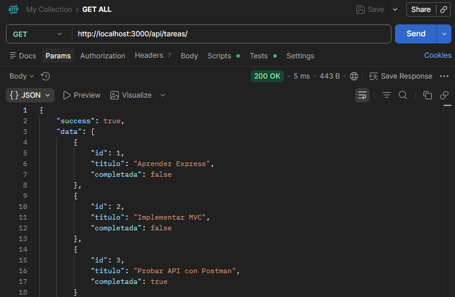
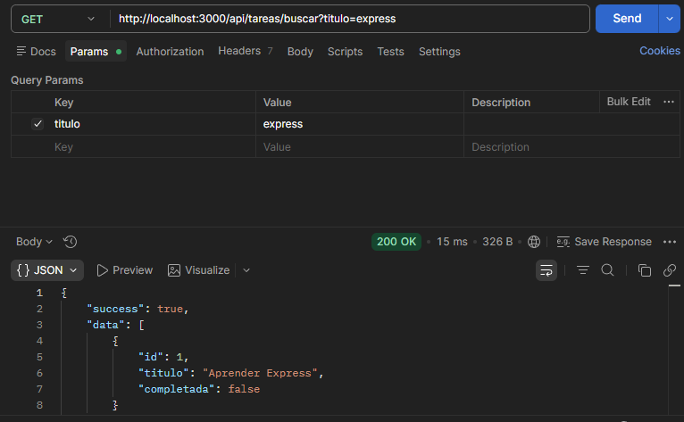
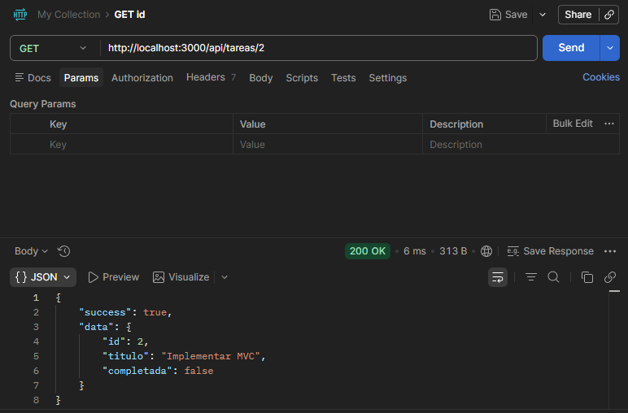
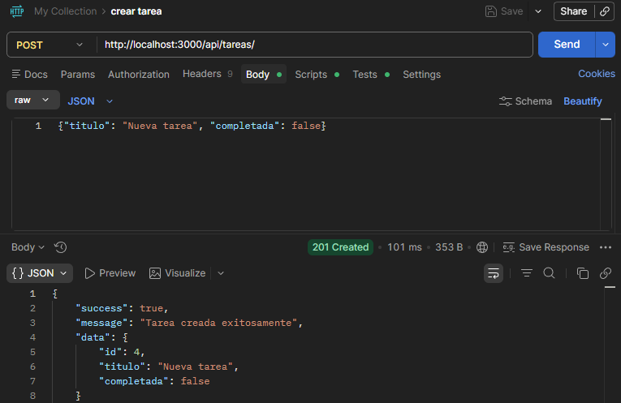
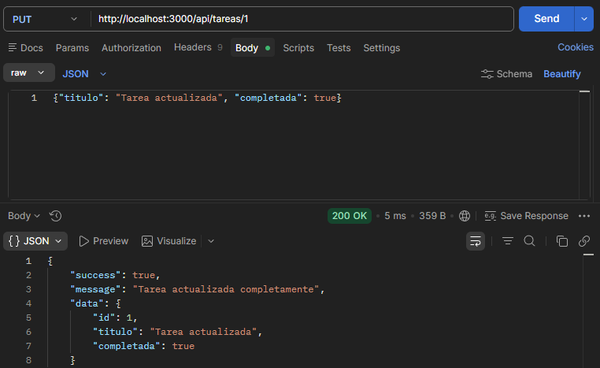
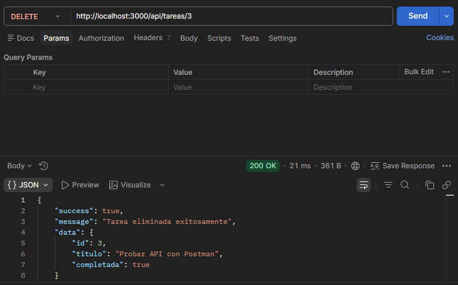
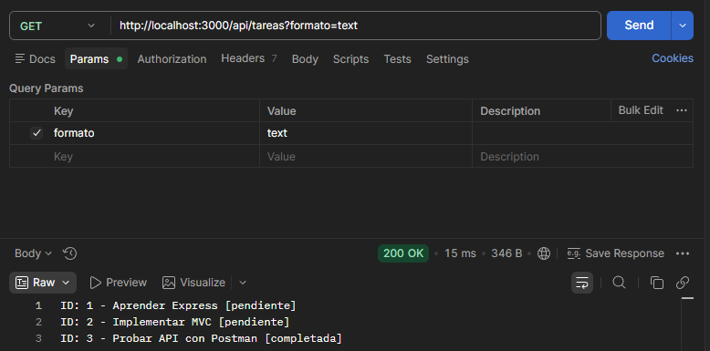

# API REST con Express - Gestión de tareas (mvc)

## Descripción del Proyecto

Este proyecto consiste en el desarrollo de una API REST para la gestión de tareas utilizando **Node.js y Express**, implementada siguiendo el patrón de arquitectura **MVC (Modelo - Controlador)**.

La API permite realizar operaciones CRUD sobre tareas utilizando una lista en memoria como almacenamiento temporal. Cada tarea contiene un identificador, un título y un estado que indica si la tarea está completada o no.

Los datos se intercambian en formato **JSON** mediante diferentes endpoints que permiten crear, consultar, actualizar y eliminar tareas.


## Seguridad y Autenticación

El sistema implementa una arquitectura de seguridad basada en capas para proteger los datos y la sesión del usuario.

### Tecnologías de Seguridad Implementadas:
* **JWT (JSON Web Tokens)**: Utilizado para la autenticación de sesiones. El token se firma en el servidor y se almacena en el cliente.
* **Cookies HTTP-Only**: El token JWT se envía mediante una cookie con el atributo `httpOnly: true`, lo que impide que scripts maliciosos de terceros accedan al token (protección contra XSS).
* **Protección CSRF (Cross-Site Request Forgery)**: Se utiliza una estrategia de doble token. Además del JWT, se genera un token CSRF aleatorio que el cliente debe enviar en los encabezados de cada petición protegida (`x-csrf-token`).
* **Validación de API Key**: Se requiere una clave de acceso estática para los procesos iniciales de autenticación.
* **CORS (Cross-Origin Resource Sharing)**: Configurado para permitir el intercambio de recursos y credenciales únicamente con el origen del frontend autorizado.

### Configuración de Variables de Entorno (.env)
Para el correcto funcionamiento del sistema, es obligatorio contar con un archivo `.env` en la raíz del directorio con los siguientes parámetros:

```env
PORT=3000
API_KEY=tu_clave_api_secreta
JWT_SECRET=tu_firma_secreta_jwt
JWT_EXPIRES_IN=1h
COOKIE_MAX_AGE=3600000
NODE_ENV=development
GOOGLE_CLIENT_ID=tu_google_client_id
GOOGLE_CLIENT_SECRET=tu_google_client_secret
GOOGLE_CALLBACK_URL=https://localhost:3000/auth/google/callback
```

## Instalación

Para instalar las dependencias del proyecto ejecutar:

```bash
npm install
```


## Ejecutar el Proyecto

Para iniciar el servidor ejecutar:

```bash
npm run dev
```

El servidor se ejecutará en:

```
http://localhost:3000
```


## Endpoints Disponibles

GET /api/tareas

GET /api/tareas/buscar?titulo=nombre

GET /api/tareas/:id

POST /api/tareas

PUT /api/tareas/:id

PATCH /api/tareas/:id

DELETE /api/tareas/:id


## Obtener todas


## Obtener por título


## Obtener por ID


## Crear tarea


## Actualizar tarea


## Actualizar tarea parcialmente


## Eliminar tarea


## Obtener en formato de texto

